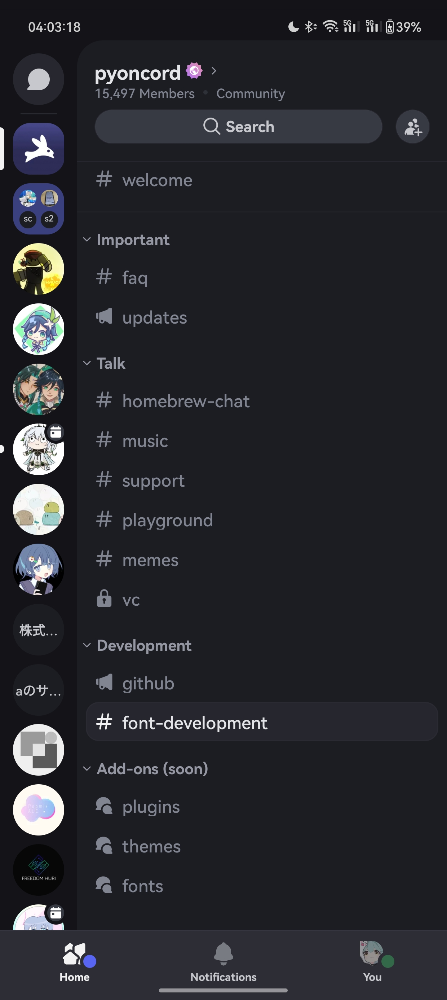
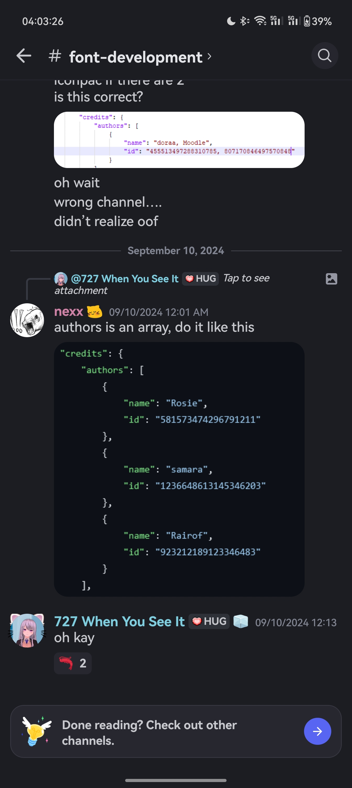
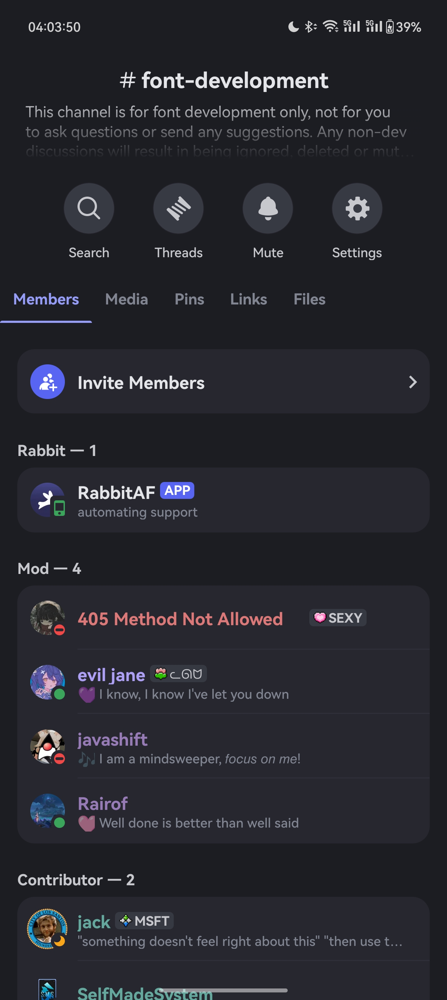
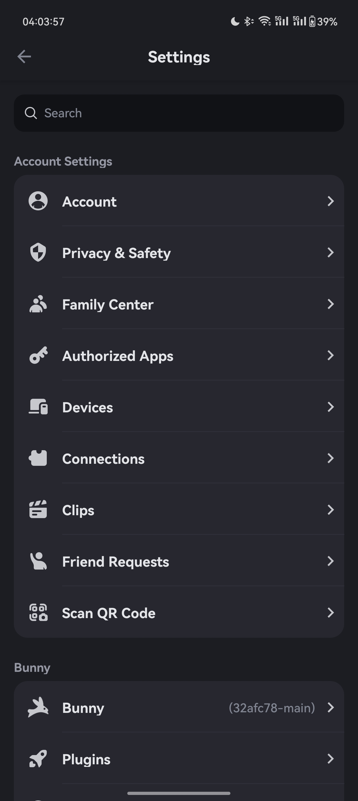

    <h1 align="center">FlatPonch's Fonts for Discord</h1>

## A basic Discord Font repository for users/themers who wants to use custom fonts by itself or in their themes.
## All Fonts will be provided in here along with a Gallery section that will showcase each fonts in a organised manner.
## I'm porting some Android OS's font.
<h1 align="center">Gallery</h1>
<h2 align="left">1. HarmonyOS Sans(Huawei)</h2>
<h2>

</h2>

## [Font Snippet](https://raw.githubusercontent.com/FlatPonch/Vendetta-Fonts/main/HarmonyOS_Sans/HarmonyOS_Sans-font-snippet.json)
## Font sourced from [here.](https://developer.huawei.com/consumer/cn/design/resource/)

<h2 align="left">2. vivo Sans(vivo's OriginOS(idk they using this on FuntouchOS))</h2>
<h2>todo

<h2 align="left">3. MiSans(Xiaomi's HyperOS(Previously used in MIUI))</h2>
<h2>todo

<!--
template(me only)

<h2 align="left">Number. Font name here</h2>
<h2>

</h2>

## [Font Snippet](https://raw.githubusercontent.com/FlatPonch/Vendetta-Fonts/main/"fontpath"/"fontname"-font-snippet.json)
## Font sourced from [here.](source here)

yk, i copy(stole) from here :P -> https://github.com/Rairof/Theme-Fonts
-->
